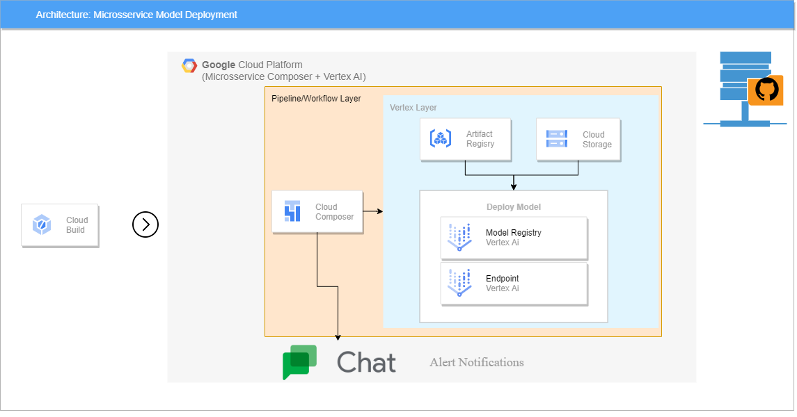
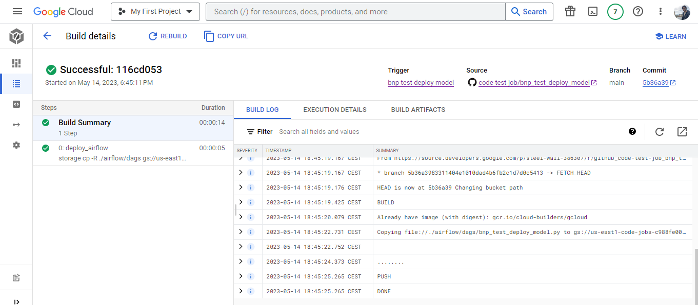
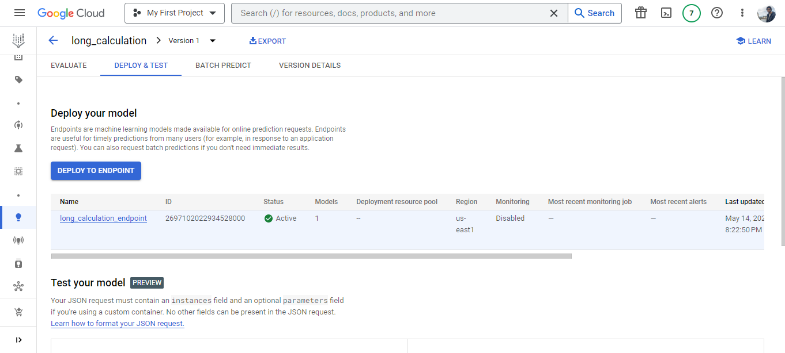

# BNP PARIBAS - TEST
Bonjour!

*OBS1 :* Lisez attentivement le fichier README.md;

<h1>Comment marche cette solution?</h1>

Cette étape consiste à déployer le modèle + endpoint, en utilisant Composer (Airflow) comme orchestration.

Un deploy dans le Vertex AI est l'association entre un modèle registré et un endpoint. L'architecture de ce microservice est la suivante: 

  

Le push vers la branche déclenche l'exécution des instructions dans cloudbuild.yaml. , comme on peut voir ci-dessous: 

  

Tout est vert, c'est-à-dire, toutes les instructions ont été exécuté avec succès. Le deploy consiste en copier la dag dans le Cloud Storage dont sera importé pour le Composer. Le Airflow va starter la dag comme on peut voir ci-dessous:

Le flow montre qui on aura upload d'un modèle, ensuite la création d'un endpoint et finalement l'association des deux, c'est-à-dire le deploy. 

Dans le Vertex AI cette association est claire

Modèle:

  

Endpoint:

  

Model associé au Endpoint:

  

<h1>Structure des dossiers</h1>

<h2>Files</h2>

- `.gitignore`: Fichiers et répertoires à exclure du suivi et de la gestion des modifications;
- `cloudbuild.yaml`: CI/CD - Cloud Build;
- `README.md`: Instructions du projet/solution;

<h2>Dossiers|Packages</h2>

- `app`: APP pour l'équipe A;
- `img`: Images pour le ReadME.md;
- `tests`: Package avec les fonctions de test;

<h1>Suggestion de branches</h1>

- [x] master - Deploy en PROD
- [x] hml    - Deploy en STAGGING
- [x] dev    - Deploy en DEVELOPEMMENT

<h1>Services GCP utilisées</h1>

- [x] Source Repository 
- [x] Cloud Build
- [x] Artifact Registry
- [x] Vertex AI - Model Registry
- [x] Vertex AI - Online Prediction (Endpoint)
- [x] Composer (Airflow)

